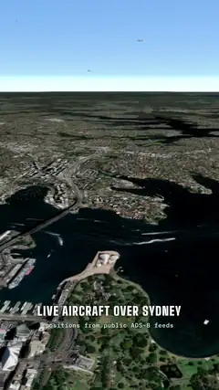
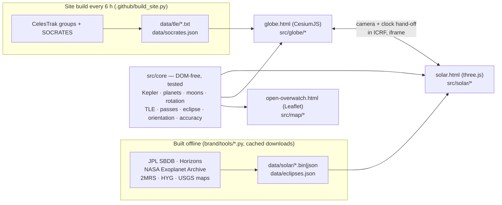

# Open Overwatch

**Everything that moves, where it really is, right now.** From the aircraft over your street to every tracked
satellite, the planets, 1.57 million asteroids, the planets of other stars and 43,480 galaxies, in **one continuous
zoom**. Positions are checked against NASA JPL. It runs in your browser (phones too), with no install, no account and
no build step.

**▶ [Website](https://cwbhood.github.io/open-overwatch/) · [3D globe](https://cwbhood.github.io/open-overwatch/globe.html) · [Solar System](https://cwbhood.github.io/open-overwatch/solar.html) · [2D ops map](https://cwbhood.github.io/open-overwatch/open-overwatch.html)** · [the 30 s clip (MP4)](brand/clip/open-overwatch-zoom.mp4)

## What you can do
- **Zoom from a street to the cosmic web without a cut.** The 3D globe hands its camera to the Solar System view past the
  Moon (same pixels, same instant, one clock), and takes it back when you zoom into Earth.
- **Look up.** On a phone, hold it to the sky: the camera follows the motion sensors and shows what is above you right
  now. That includes satellites, aircraft, the planets and the bright stars, plus your next ISS pass.
- **Watch near misses happen.** The closest upcoming conjunctions in orbit (CelesTrak SOCRATES): pick one and the
  clock jumps to 45 s before closest approach, with both objects and their orbits on screen.
- **See the 2027 eclipse before it happens.** The Moon's shadow crosses the globe for every solar eclipse of 2027–2030,
  with how much of the Sun each one covers from where you are.
- **Fly into another solar system.** 6,339 exoplanets at their real stars. TRAPPIST-1's seven worlds orbit at their real
  speeds, positioned from their measured transit times, with the habitable zone drawn in.
- **Light is slow at this scale.** A "ghost" shows where Earth actually sees Jupiter (49 light-minutes ago), and our
  radio bubble (everything broadcast since 1920) lights up the stars it has reached.
- **2D ops map:** aircraft, military flights, ships, quakes, storms, radar, cameras and news on one dark map.

## How it's built

- **No build step.** The pages load ES modules from `src/`, and the libraries (CesiumJS 1.146, three.js 0.186,
  Leaflet 1.9, satellite.js 5) come from CDNs.
- **One frame of reference:** heliocentric ecliptic J2000, AU and Julian dates in the Solar System view. Earth-fixed
  positions use Cesium's IAU 2006 rotation, and the hand-off between the two views goes through the ICRF.
- **1.57M asteroids in one draw call per file:** 15-byte packed orbital elements, with Kepler's equation solved per
  point in the vertex shader every frame.
- **18,000+ satellites** propagated with SGP4 in a web worker; the dots follow the clock at any speed and in reverse.
- **A log depth buffer** spans 26 orders of magnitude: from 150 m to 16 billion light-years in one scene.

## Accuracy (asserted by the tests, and measured live in the app's "Under the hood" panel)
| | Error vs NASA JPL |
|---|---|
| Planets (JPL approximate elements) | 2″ (Venus) to 4.4′ (Saturn) |
| Moon | 0.9′ · 189 km |
| 20 major moons (orbits fitted to Horizons) | ≤ 0.4° (Io 0.75′, Titan 0.09′) |
| Eclipse of 2 Aug 2027 | greatest eclipse 25.51°N 33.16°E, 10:06:39 UT, 6 min 27 s (NASA: 25°31′N 33°08′E, 6 min 23 s) |
| Satellites | SGP4 from public element sets: ~1 km at epoch, 1–3 km/day after |

## Speed
Measured with `brand/tools/perf.mjs`, `zoomtest.mjs` and `mobile_journey.mjs`; details are in
[docs/PERFORMANCE.md](docs/PERFORMANCE.md).

| | |
|---|---|
| Desktop (RTX 3060) | 165 fps (the display's refresh rate) in every view at rest; ~120 fps flying the globe; 5 frames over 50 ms in an 18 s round trip from Earth to the stars and back |
| Phone (emulated mid-range Android, 4G) | globe on screen in 6.4 s / 4.9 MB; Solar System in 4.1 s / 3.2 MB |
| Adaptive | High / Balanced / Low graphics; Auto steps down when frames run slow; it detects software WebGL |

## Run it
- **Online:** use the links above.
- **Locally:** `node serve.js` (or `python3 serve.py`), then open http://127.0.0.1:8787/.
  - The helper relays the few feeds that send no CORS headers. That adds live civil aircraft in the 2D map.
  - Windows: `Start Open Overwatch.bat`.
- **Tests:** `node --test`. That runs 43 tests against JPL Horizons fixtures and textbook identities, with no
  dependencies. CI also checks every module's syntax and every page's links.

| Path | What |
|---|---|
| `src/core/` | the maths, DOM-free and unit-tested |
| `src/globe/`, `src/solar/`, `src/map/` | the three views |
| `brand/tools/` | data builders (Python), performance and capture tools (Node, headless Chromium over CDP), Blender scripts |
| `docs/` | [architecture](docs/ARCHITECTURE.md), [data sources and licences](docs/DATA_SOURCES.md), [performance](docs/PERFORMANCE.md), notes |

## Credits
NASA JPL (SBDB, Horizons, approximate planetary elements), NASA Exoplanet Archive, NASA GIBS (Blue Marble, Black
Marble), NASA/GSFC SVS Deep Star Maps, USGS Astrogeology and NASA/JPL/SSI moon maps (Phobos: ESA/DLR/FU Berlin,
CC BY-SA 3.0 IGO), 2MASS Redshift Survey (Huchra et al. 2012), HYG v4.1 (CC BY-SA), Solar System Scope textures
(CC BY 4.0), the Milky Way artwork by NASA/JPL-Caltech/R. Hurt, and CelesTrak (GP data, SOCRATES).
Live feeds: adsb.lol, adsb.fi, airplanes.live, OpenSky, USGS, NOAA, NASA EONET/FIRMS, GDACS, GDELT, Digitraffic,
aisstream.io, SondeHub, RainViewer, TeleGeography. Basemap © Esri. Full list with terms:
[docs/DATA_SOURCES.md](docs/DATA_SOURCES.md). These are public and volunteer services; check each one's terms before
any commercial use.

## The creator
Made by Destin Jones ([@cwbhood](https://github.com/cwbhood)), with Claude as the building partner. Also by Destin:
**[Ironbound](https://github.com/cwbhood/godot-open-rts)**, a free, open source 3D real-time strategy game built in Godot
where your city builds itself while you run the army and the trade routes.

Please fork this project and build anything you like with it. If you make something, I'd love to see it.
