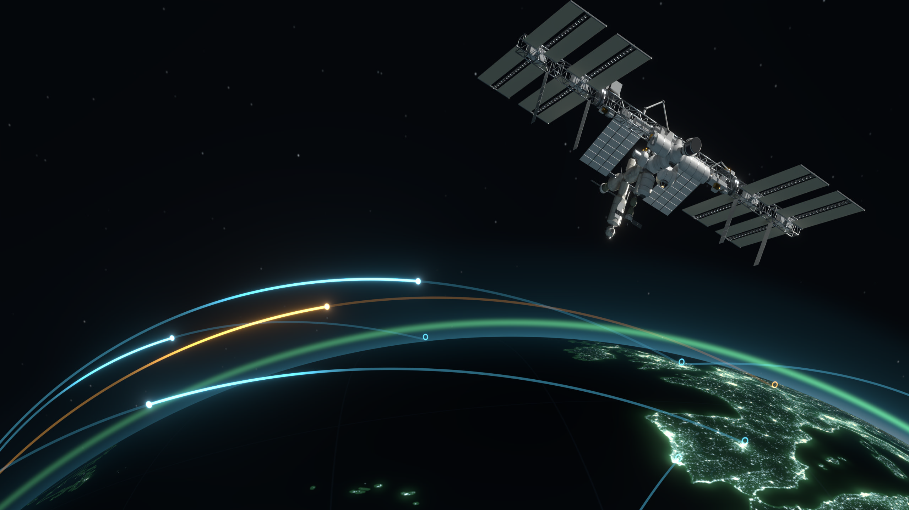

# Open Overwatch

**The whole planet, live.** Aircraft, military flights, satellites, ships, storms, quakes and public cameras on one
dark ops-room map, straight from open data. No account, no tracking, one HTML file.

**▶ [Website](https://cwbhood.github.io/open-overwatch/) · [Open the live map](https://cwbhood.github.io/open-overwatch/open-overwatch.html) · [Download](https://github.com/cwbhood/open-overwatch/releases/latest/download/open-overwatch.zip)**

## Run it
- **In the browser:** open the live map link above. Satellites, quakes, storms, ships, news, radar and cameras work as-is.
- **Full version (adds live aircraft):** download the zip, unzip, double-click `Start Open Overwatch.bat`
  (or `python3 serve.py` / `node serve.js` on Mac and Linux). A few feeds (the ADS-B networks, OpenSky, NOAA NHC, some
  cameras) refuse requests from web pages; the bundled helper relays only those. See `README.txt`.

## What's in the repo
| Path | What |
|---|---|
| `index.html` | the landing page (GitHub Pages) |
| `open-overwatch.html` | the whole map app |
| `globe.html` | 3D globe view (prototype, CesiumJS) |
| `serve.js` / `serve.py` | local helper: static server + CORS relay for an allowlist of hosts |
| `brand/` | emblem, hero renders, 3D models, promo pack, and the Blender scripts that build them ([brand/README.md](brand/README.md)) |

## Publishing a new version
Double-click **`Publish Update.bat`**, type the new version number and one line about what changed. It bumps the
version in the app, commits, tags and pushes. GitHub then redeploys the website and builds a fresh
`open-overwatch.zip` on the [Releases](https://github.com/cwbhood/open-overwatch/releases) page, and the
website's download button always points at the newest one.

## Credits
Data: adsb.lol, adsb.fi, airplanes.live, OpenSky, CelesTrak, USGS, NOAA (NHC, NWS, SWPC), NASA (EONET, FIRMS),
GDACS, GDELT, Digitraffic, aisstream.io, SondeHub, RainViewer, TeleGeography. Basemap © Esri. Night lights: NASA
Black Marble. These are public and volunteer services; check each provider's terms before any commercial use.
